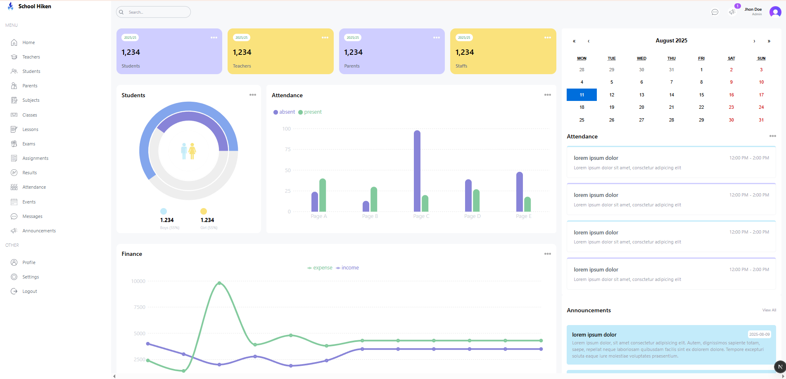

# 🚀 My Next.js + Tailwind Project


---

## 📸 Screenshot

### Tampilan Halaman Utama



---

## 📦 Teknologi yang Digunakan

- **Next.js** – Framework React untuk SSR & SSG.
- **Tailwind CSS** – Utility-first CSS framework.
- **TypeScript** – JavaScript dengan type safety.

---

## Getting Started

First, run the development server:

```bash
npm run dev
# or
yarn dev
# or
pnpm dev
# or
bun dev
```

Open [http://localhost:3000](http://localhost:3000) with your browser to see the result.
